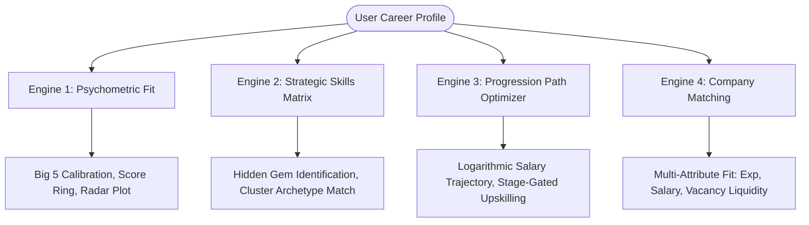

# Command Q — Career Navigation System for Data Talent Workforce
### A Data-Driven Approach to Skills Alignment and Career Progression

[](https://github.com)
[](index.html)
[](LICENSE)
[](https://python.org)

**Team:** Command Q  
**Team Leader:** Rajat Kumar Gupta (`25BDA70384`)  
**Hackathon Track:** Build for Bharat 2.0 — Approach Notice Submission  
**Interactive Web Application:** Hosted statically via [GitHub Pages](index.html) (`index.html`, `styles.css`, `app.js`)

---

## 📌 Executive Summary

The data science and analytics workforce in India and globally faces a critical structural challenge: aspiring and practicing professionals struggle to navigate career progression effectively due to profound information asymmetry. Despite surging demand for data talent, individuals lack empirical clarity regarding:
1. **Personality-Role Congruence:** How foundational Big Five psychometric traits dictate long-term success in high-ambiguity senior technical leadership.
2. **Skills Valuation Disconnect:** Which competencies drive internal promotion velocity versus advertised hiring demand, avoiding market signaling distortions.
3. **Strategic Human Capital Investment:** How to allocate finite reskilling hours to maximize competitive differentiation and wage appreciation.
4. **Employer-Experience Alignment:** Which organizations offer optimal compensation brackets and vacancy liquidity for an individual's career tenure.

This repository contains the end-to-end empirical research foundation, econometric models, publication-grade figures, data artifacts, and an inspectable, client-side **Career Navigation Engine** powered by analysis across **16,741 workforce records** cleaned to >99.4% retention.

---

## 🏛 Repository Architecture

The project structure is organized to ensure end-to-end transparency and reproducibility:

```
CommandQ_CareerNav/
│
├── index.html                               # GitHub Pages interactive web application entrypoint
├── styles.css                               # Deep Space glassmorphism design system & responsive styling
├── app.js                                   # Client-side execution logic, Chart.js visualizations & engines
├── LICENSE                                  # Open-source license (MIT)
├── README.md                                # Comprehensive repository documentation
│
├── Documents/                               # Problem briefs & competition documentation
│   ├── Command Q Approach Notice.pdf        # Approach Notice submission document
│   ├── Data Description Doc.pdf             # Original data schemas & variables overview
│   └── Problem Context Brief, ... .pdf      # Problem context, SAS VFL demos, and guidelines
│
├── Source/                                  # Primary analytical notebooks
│   ├── DD_Foundation_Analysis.ipynb         # Exploratory data analysis, cleaning & baseline models
│   ├── DD_Foundation_Analysis_Executed.ipynb# Fully executed notebook with inline plots and statistics
│   └── second pass analysis.ipynb           # Cross-dataset synthesis, effect size derivations & validation
│
├── cleaned data/                            # Curated, cleaned datasets (>99.4% record retention)
│   ├── Analytics_Jobs_clean.csv             # Analytics postings cleaned (N=14,749, 0.6% dropped)
│   ├── DataScience_Jobs_clean.csv           # Core DS jobs cleaned (N=1,595, 0.4% dropped)
│   ├── JDS_Skill_Traits_clean.csv           # Junior skills & hike outcomes (N=139, 0.0% dropped)
│   └── SDS_Personality_Traits_clean.csv     # Senior Big Five traits & success flags (N=161, 0.0% dropped)
│
├── analysed data/                           # Derived econometric tables, bridges & benchmark matrices
│   ├── analytics_core_no_text.csv           # Lightweight feature table for salary modeling
│   ├── bridge_market_by_seniority.csv       # Market seniority bands vs. salary distributions
│   ├── bridge_personality_proxy.csv         # Big Five proxy distributions across seniority tiers
│   ├── bridge_skill_alignment.csv           # 2x2 Strategic Skills Matrix with Rank Gap metrics
│   ├── bridge_skill_demand_by_seniority.csv # Skill posting trajectory (Junior -> Mid -> Senior)
│   ├── dsj_core.csv                         # Analyzed DS jobs with log salary & senior flags
│   ├── jds_core.csv                         # Junior skills with cluster assignments (k=3)
│   ├── sds_core.csv                         # Senior personality traits with cluster labels
│   ├── table_dsj_senior_premium.csv         # Senior salary premiums by role family (+56% to +72%)
│   ├── table_jds_effects.csv                # Junior skill effect sizes (Cohen's d, AUC, p-values)
│   ├── table_sds_effects.csv                # Senior personality effect sizes (Cohen's d, AUC, p-values)
│   └── table_skill_salary_premium.csv       # Experience-controlled marginal skill premiums
│
├── figures/                                 # Publication-grade figures (IEEE/LaTeX ready)
│   ├── an_seniority_salary_band.png         # Salary distributions across analytics seniority bands
│   ├── analytics_jobs_distributions.png     # Distribution of experience, salary, and openings
│   ├── categorical_overview.png             # Role family and company distribution overviews
│   ├── cv_model_benchmarks.png              # 5-fold CV ROC-AUC benchmarks across models
│   ├── datascience_jobs_distributions.png   # DS jobs distribution checks & outlier validation
│   ├── dsj_experience_salary.png            # Logarithmic experience-salary regression fit
│   ├── dsj_salary_by_title.png              # Salary distributions grouped by job title
│   ├── jds_cluster_profiles.png             # Radar profiles for the 3 junior skill clusters
│   ├── jds_clusters.png                     # K-Means clustering breakdown for junior practitioners
│   ├── jds_correlation.png                  # Correlation matrix of technical vs. soft competencies
│   ├── jds_outcome_comparison.png           # Mean skill comparisons for hike vs. non-hike cohorts
│   ├── jds_pca.png                          # PCA biplot of junior skills variance decomposition
│   ├── jds_skill_distributions.png          # Proficiency distribution plots across 5 competencies
│   ├── logistic_odds_ratios.png             # Odds ratio forest plots for trait & skill predictors
│   ├── prototype_architecture.png           # Four-engine system architecture diagram
│   ├── salary_permutation_importance.png    # Permutation feature importance for salary models
│   ├── salary_regression_benchmarks.png     # Ridge vs. Gradient Boosting CV benchmarks
│   ├── sds_clusters.png                     # K-Means clustering for senior personality archetypes
│   ├── sds_correlation.png                  # Correlation matrix of Big Five personality dimensions
│   ├── sds_outcome_comparison.png           # High vs. low senior performer personality profiles
│   ├── sds_pca.png                          # PCA visualization of senior leadership dimensions
│   ├── sds_trait_distributions.png          # Trait distributions across high and low performers
│   ├── seniority_salary_premium.png         # Senior salary jump percentages across role families
│   ├── sensitivity_analysis.png             # Robustness checks across flagged/cleaned subsamples
│   ├── skill_alignment_scatter.png          # 2x2 Strategic Skills Matrix scatter plot
│   └── skill_demand_evolution.png           # Demand growth vs. contraction across career stages
│
└── Scratch/                                 # Build automation, TeX generation & verification
    ├── create_advanced_notebook.py          # Programmatic Jupyter notebook builder with advanced cells
    ├── generate_additional_figures.py       # Script generating all 26 high-resolution figures
    ├── generate_final_submission_tex.py     # LaTeX compiler producing IEEE conference paper
    ├── submission_source.tex                # Complete IEEE-formatted submission source code
    └── verify_extract.py                    # Cross-verification script auditing all statistics & metrics
```

---

## 🔬 Core Empirical Findings

Our research is grounded in 4 primary datasets covering **16,741 records**:

| Dataset | Original $N$ | Cleaned $N$ | Retention | Core Constructs Measured |
| :--- | :---: | :---: | :---: | :--- |
| **SDS Personality** | 161 | 161 | 100.0% | Big Five Traits (OCEAN), Binary Success Flag |
| **JDS Skills** | 139 | 139 | 100.0% | 5 Technical & Communication Skills, Salary Hike Flag |
| **Data Science Jobs** | 1,602 | 1,595 | 99.6% | Min/Max Exp, Avg Salary (LPA), Openings, Roles |
| **Analytics Jobs** | 14,834 | 14,749 | 99.4% | Titles, Categorized Skills, Exp Brackets, Salary |

### 1. Senior Leadership: The Big Five Dominance
Senior data science success is overwhelmingly governed by **Conscientiousness** and **Openness to Experience**:
* **Conscientiousness:** $d = 1.815$ ($p = 7.2 \times 10^{-16}$, single-trait $\text{AUC} = 0.878$, $\text{OR} = 8.11$).
* **Openness:** $d = 1.774$ ($p = 1.8 \times 10^{-16}$, single-trait $\text{AUC} = 0.885$, $\text{OR} = 7.42$).
* **Extraversion:** $d = 1.115$ ($p = 2.9 \times 10^{-9}$, single-trait $\text{AUC} = 0.783$).
* **Emotional Stability (Neuroticism):** $d = -0.012$ ($p = 0.454$, non-significant directly, but essential hygiene factor).
* **Multi-trait Logistic Model:** Repeated 5-fold CV achieves **$\text{ROC-AUC} = 0.964$** (Random Forest: $0.996$).

### 2. Junior Promotion: The Technical vs. Communication Differentiator
For junior practitioners, communication and foundational mathematics surpass pure algorithmic depth:
* **Dashboard & Storytelling:** $d = 1.302$ ($p = 1.2 \times 10^{-10}$, $\text{AUC} = 0.794$, $\text{OR} = 3.06$) — **#1 internal differentiator**.
* **Math & Statistics:** $d = 1.202$ ($p = 3.3 \times 10^{-8}$, $\text{AUC} = 0.775$, $\text{OR} = 2.81$).
* **Coding Skills:** $d = 0.976$ ($p = 1.0 \times 10^{-6}$, $\text{AUC} = 0.744$).
* **AI & Machine Learning:** $d = 0.863$ ($p = 4.3 \times 10^{-4}$, $\text{AUC} = 0.682$).
* **Big Data Skills:** $d = 0.223$ ($p = 0.217$, non-significant for junior hike velocity).
* **Multi-skill Logistic Model:** Repeated 5-fold CV achieves **$\text{ROC-AUC} = 0.903$** (Random Forest: $0.875$).

### 3. Econometric Salary Progression
* Parametric wage curve: $\text{Salary (LPA)} = 7.20 + 5.30 \cdot \ln(\text{Experience} + 1)$ ($R^2 = 0.571$).
* Permutation importance confirms experience explains **50.4%** of salary variance, role family explains **43.5%**, while individual technical keywords explain $<2\%$.
* Senior salary transitions deliver substantial jumps across all tracks:
  - **Data Analyst:** ₹5.0 LPA $\to$ ₹8.6 LPA (**+72.0%**)
  - **Business Analyst:** ₹8.3 LPA $\to$ ₹13.0 LPA (**+56.6%**)
  - **Data Scientist:** ₹12.85 LPA $\to$ ₹21.2 LPA (**+65.0%**)
  - **Data Engineer:** ₹10.85 LPA $\to$ ₹17.6 LPA (**+62.2%**)
  - **Data Architect:** ₹24.25 LPA (senior/principal leadership band)

---

## 🌉 The Five Strategic Bridges

Our cross-sectional synthesis links disparate workforce datasets into 5 overarching market principles:

1. **The Storytelling Paradox (Bridge 1):**  
   Storytelling is the single strongest internal promotion lever ($d=1.30$), yet appears in only $7.1\%$ of external job listings with a raw $-₹4.5\text{L}$ penalty. External recruiters treat "dashboards" as low-tier operational reporting, while engineering directors gate senior elevations on executive translation capacity.
2. **The Big Data Timing Disconnect (Bridge 2):**  
   Big Data yields virtually zero lift for juniors ($d=0.22$), but market demand surges by **$+119.5\%$** between junior ($7.7\%$) and senior ($16.9\%$) roles. Premature investment in distributed infrastructure over-taxes junior bandwidth; delaying past Year 4 caps senior advancement.
3. **Skill Premium Evaporation (Bridge 3):**  
   Individual skills offer up to $+₹3.5\text{L}$ wage premiums at the junior level, but evaporate to $₹0.0\text{L}$ at mid and senior levels. Individual tools shift from scarcity assets to baseline hygiene factors; senior earnings are unlocked via title/role elevation rather than certification hoarding.
4. **Psychometric–Technical Co-Evolution (Bridge 4):**  
   Early career trajectory is driven by tactical tool execution; senior performance is dictated by Conscientiousness ($d=1.81$) and Openness ($d=1.77$). As work shifts from well-defined tasks to ambiguous strategic formulation, character and governance drive organizational impact.
5. **The Specialization Trap (Bridge 5):**  
   Junior K-Means clustering ($k=3$) reveals that **Balanced All-Rounders** (Cluster 1, $n=78$) achieve an **$83.3\%$** salary hike rate, whereas **ML-Only Specialists** (Cluster 2, $n=38$) achieve only **$18.4\%$**. Over-investing in ML algorithms while neglecting coding foundations and storytelling leads to career stagnation.

---

## ⚡ The Four Analytical Engines (Live Web App)

The static web application (`index.html`) implements a fully responsive, client-side career navigation interface with zero backend latency:



1. **Engine 1: Psychometric Fit Engine**
   - Calibrated against senior empirical means ($C=53.7, O=48.5, E=48.9, N=36.1, A=47.7$).
   - Computes weighted composite alignment, animates a circular SVG score ring, provides developmental diagnostic feedback, and renders a dynamic radar plot.
2. **Engine 2: Strategic Skills Recommendation Engine**
   - Maps user competencies onto the $2 \times 2$ Strategic Market Matrix (Hidden Gems vs. Core Pillars vs. Stage-Gated).
   - Classifies user profile against the empirical junior clusters (predicting hike probability from $4.3\%$ to $83.3\%$).
3. **Engine 3: Progression Path Optimizer**
   - Implements the parametric logarithmic salary model across 5 role families.
   - Plots customized salary projections from Year 0 to Year 15 and outputs stage-gated learning sequences.
4. **Engine 4: Multi-Attribute Company Matching**
   - Evaluates multi-attribute utility across top employers (TCS, Accenture, Cognizant, Wipro, IBM, Genpact, Capgemini, L&T Infotech, Deloitte, Amazon, etc.).
   - Jointly optimizes experience fit (Gaussian distance), salary target, and liquidity (log job volume).

---

## 🚀 Getting Started & Local Setup

### Live Web Application (Zero Installation)
Simply open `index.html` in any modern web browser or serve it via any static HTTP server:

```bash
# Clone the repository
git clone https://github.com/swanpyaesone163-dev/CommandQ_CareerNav.git
cd CommandQ_CareerNav

# Option A: Open directly in browser
# (Double click index.html)

# Option B: Run via Python lightweight server
python -m http.server 8080
# Visit http://localhost:8080 in your browser
```

### Reproducing Analytics & Machine Learning Pipeline
All data processing and machine learning workflows are completely automated and reproducible:

```bash
# 1. Ensure Python dependencies are installed
pip install pandas numpy scikit-learn matplotlib seaborn jupyter

# 2. Re-generate all derived tables and figures
python Scratch/generate_additional_figures.py

# 3. Compile the submission paper LaTeX source
python Scratch/generate_final_submission_tex.py

# 4. Verify all statistics and benchmarks
python Scratch/verify_extract.py

# 5. Launch interactive analysis notebooks
jupyter notebook Source/DD_Foundation_Analysis.ipynb
```

---

## 📊 Summary of Benchmark Models

### Classification Models (5-Fold CV $\times$ 10 Repeats)

| Model | SDS Senior Leadership (AUC) | SDS Accuracy | JDS Salary Hike (AUC) | JDS Accuracy |
| :--- | :---: | :---: | :---: | :---: |
| **Baseline (Majority)** | 0.500 | 52.8% | 0.500 | 52.5% |
| **Decision Tree (depth 3)** | 0.942 | 93.4% | 0.800 | 78.2% |
| **Random Forest** | **0.996** | **94.9%** | 0.875 | 82.4% |
| **Standardized Logistic Regression** | 0.964 | 92.7% | **0.903** | **85.7%** |

### Salary Regression Models (5-Fold CV)

| Model | Target | CV $R^2$ | CV MAE | Top Predictive Feature |
| :--- | :--- | :---: | :---: | :--- |
| **Ridge Regression** | $\ln(\text{avg\_salary})$ (DS Jobs) | **0.571** | **0.305** | Min Experience (Importance: 0.504) |
| **HistGradientBoosting** | `salary_mid` (Analytics Jobs) | **0.444** | **4.989 LPA** | Min Experience (Importance: 0.798) |

---

## 👥 Team & Acknowledgments

* **Team:** Command Q
* **Team Leader:** Rajat Kumar Gupta (`25BDA70384`)
* **Competition:** Build for Bharat 2.0 Hackathon

Developed for the purposes of the hackathon competition, using mandated datasets only.
